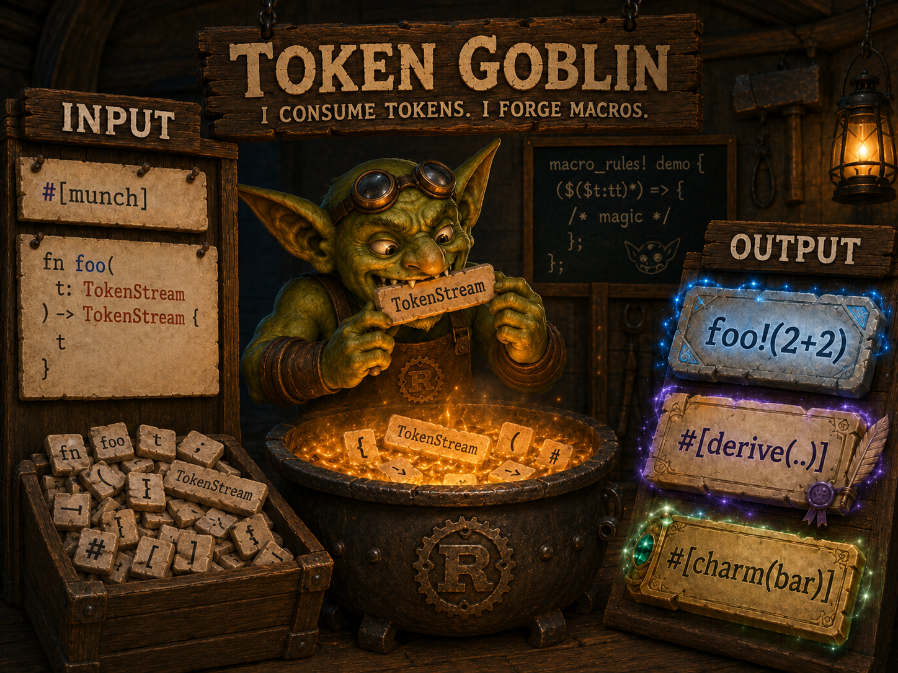
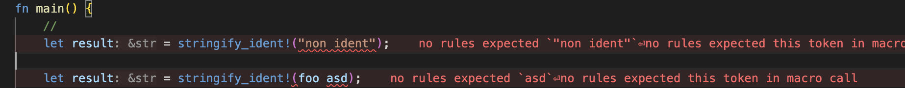
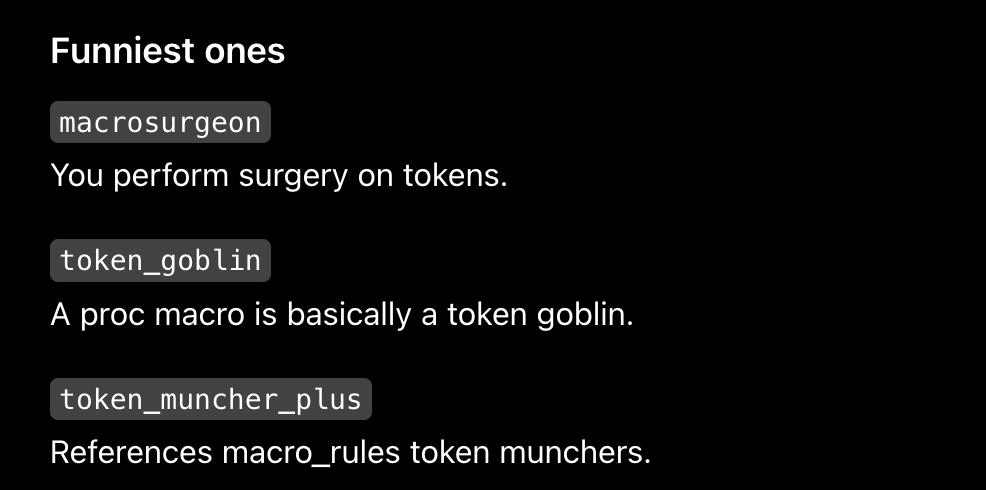

# Token Goblin — munches your tokens, forge out charms



`token-goblin` is a proc-macro library for defining inline proc-macro, directly inside your crate, without separate proc-macro target.

It is inspired by crates like `crabtime` and `inline-proc`, but aims to provide a more polished, flexible, and ergonomic API.

## Getting started

Add `token-goblin` to your crate:

```toml
[dependencies]
token-goblin = "0.1.0"
```

Then try:

```rust
#[token_goblin::munch]
fn foo(input: TokenStream) -> TokenStream {
    input
}
```

This generates a new macro, or **charm**, named foo!:

```rust
foo!(bar baz); // will expand to `bar baz`
```

In other words, `#[munch]` turns the function into a new macro.

Note: beacause `token-goblin::munch` are macros that generate macros, **charm** term would be used for generated macros in docs for clarity (and a little bit of lore).

# Usecases

## Simple string based API like in `crabtime`

Some users don't want to mess with `proc-macro` API, they found it foreign and confusing.
`crabtime` showed another way to write macro - a simple string based API, that allows to use `String` and `Vec<String>` dirrectly as input of macro.

Example adopted from `crabtime` docs:

```rust
#[token_goblin::munch]
fn generate_enums(components: CommaSeparated<Token>) {
    let components: Vec<String> = components.into();
    for dim in 1..=components.len() {
        let cons = components[0..dim].join(",");
        output_str! {
            "#[derive(Debug)]
            enum Enum{dim} {{
                {cons}
            }}"
        }
    }
}

generate_enums!["X", "Y", "Z", "W", "V", "U", "T", "S", "R", "Q"];
```

which will expand to:

```rust
enum Enum1 { X }
// ... up to
enum Enum10 { X, Y, Z, W, V, U, T, S, R, Q }
```

Note: while it is inspired by `crabtime`, and `token-goblin` adopted this approach, instead of hardcoding `String`, `Vec<String>` type handling, **input is expected to implement `syn::parse::Parse` trait**.
So `CommaSeparated<Token>` is just two wrappers in `token-goblin-runtime` crate, that provides required `syn::parse::Parse` implementation.

## Inline proc-macro

String based API is simple, but it's looses span information, and reduces IDE/diagnostics quality.

If you don't want to lose span informations, but it stills annoys you, that to implement a simple
`proc-macro` you need to create a separate crate.
`token-goblin` provides a classic `proc-macro2` API as well:

```rust
#[token_goblin::munch]
fn foo(input: TokenStream) -> TokenStream {
    // ..
}
```

And even better, it's support `syn` based types as input params:

```rust
#[token_goblin::munch]
fn stringify(input: syn::Ident) -> TokenStream {
    let v = input.to_string();
    quote! {
        #v
    }
}
```

Or, you can define multiple `charms` in one module, and extend input param

<details>
  <summary>Or, you can define multiple `charms` in one module, and extend input param</summary>

    ```rust
    #[token_goblin::munch]
    mod macros {
        struct StructParam {
            // ..
        }
        impl syn::parse::Parse for MyStruct {
            //..
        }
        /// Note: ALL `pub fn`/`pub(crate) fn` are considered as entrypoints.
        /// Note2: No need to write `#[token_goblin::munch]` before each `pub fn`, it's already implied.
        pub fn generate_enums(components: CommaSeparated<Token>) -> TokenStream {
            // ..
        }
        pub fn generate_structs(param: StructParam) -> TokenStream {
            // ..
        }
    }

    macros::generate_enums!["X", "Y", "Z", "W", "V", "U", "T", "S", "R", "Q"];
    macros::generate_structs!{Foo};
    ```


</details>

## Probes, and evals

The other common cases for macros is to precomupte some data.
`crabtime` provides `eval` macro for this purpose.

But with token-goblin, you can implement it by yourself:
```rust
macro_rules! eval {
    ($($expr:tt)*) => {
        {
            #[token_goblin::munch(lazy)]
            fn eval_inner(_: TokenStream) -> TokenStream {
                use std::str::FromStr;
                let x = $($expr)*;
                TokenStream::from_str(&format!("{}", x)).unwrap()
            }
            eval_inner!($($expr)*)
        }
    };
}

fn main() {
    // Example from crabtime docs:
    let x = eval!((std::f32::consts::PI.sqrt() * 10.0).round() as usize);
    println!("x: {x}");
}
// prints:
// x: 18
```

<details>
<summary>Some cursed examples of using proc-macros</summary>

But you are not limited to simple expressions, in fact you can do any compile-time execution, like
evaluating bytecodes, or even downloading something from the internet (using external states in macro is not recommended though).

e.g. from [example_readme/examples/brainfuck.rs](example_readme/examples/brainfuck.rs)

```rust
#[token_goblin::munch]
mod brainfuck {
    pub fn execute(input: ProgramInput) -> TokenStream {
        // ..
    }

    pub fn request_and_execute(input: ProgramInput) -> TokenStream {
        // Handle program field as URL.
        let url = String::from_utf8(input.program.value()).unwrap();
        let program = reqwest::blocking::get(url).unwrap().text().unwrap();
        execute(ProgramInput {
            program: syn::LitByteStr::new(&program.as_bytes(), Span::call_site()),
            input: input.input,
        })
    }
}
```

```rust
    let result = brainfuck::request_and_execute!(b"https://gist.githubusercontent.com/vldm/f796f0d6235a608c0bed5957d146f8c0/raw/a068d4a8b2764fbc02b909322f31321b1b7eb7fc/reverse.bf", b"\n!dlroW olleH");
    println!("result: {result}");
    // downloads: ">,[>,]<[.<]" program that reverses input
    // prints:
    // result: Hello World!
```

While executing brainfuck program, is pure-functional and therefore fits well to `proc-macro` purposes, using system API and requesting external data is clearly misuse. But the whole crate is experiments around `proc-macro`, so i think it's fun to
showcase it as well.

Note: While `token-goblin` itself doesn't cache the output of `charms`, the rust itself might cache them, especially when `-Zcache-proc-macros` is enabled.

Note: I there is a plan to implement `wasm` as feature that will enforce sandboxing of `charms`.

</details>


## Rewriting declarative macros to proc-macro API

While proc-macro API is more Rust-like and powerful, one might want to rewrite all declarative macros to proc-macro API.
But working with TokenStream introduce some boilerplate, and some macros should be kept as declarative.

<details>
<summary>Example of TTs muncher rewrite as example</summary>


    [TTs muncher](https://lukaswirth.dev/tlborm/decl-macros/patterns/tt-muncher.html) is a technique of writing recursive declarative macros, to parse complex input.

    If we took example from link above (slightly modified):

    ```rust
    macro_rules! trace {
        () => {};

        ($name:ident; $($tail:tt)*) => {{
            println!("{} = {:?}", stringify!($name), $name);
            trace!($($tail)*);
        }};

        ($name:ident = $value:expr; $($tail:tt)*) => {{
            let $name = $value;
            println!("{} = {:?}", stringify!($name), $name);
            trace!($($tail)*);
        }};
    }
    ```

    It expects input in format:

    ```rust
    let a = 10;
    trace! {
        x = 2 + 3;
        y = x * 10;
        x;
        y;
    }
    ```
    expands to something like:

    ```rust
    {
        let x = 2 + 3;
        println!("x = {:?}", x);
        {
            let y = x * 10;
            println!("y = {:?}", y);
            {
                println!("x = {:?}", x);
                {
                    println!("y = {:?}", y);
                }
            }
        }
    }
    ```

    and produces output into console:
    ```
    x = 5
    y = 50
    x = 5
    y = 50
    ```


    Rewritting it as to proc-macro `TokenStream` API, will increase amount of code, and contain a lot of boilerplate:

    ```rust
    #[token_goblin::munch]
    fn trace_cycle(input: TokenStream) {
        let mut iter = input.into_iter().peekable();

        while iter.peek().is_some() {
            let Some(TokenTree::Group(g)) = iter.next() else {
                panic!("Expected group");
            };
            let Some(TokenTree::Ident(ident)) = iter.next() else {
                panic!("Expected ident");
            };
            let mut expr = (&mut iter)
                .take_while(|token| !matches!(token, TokenTree::Punct(p) if p.as_char() == ';'))
                .collect::<Vec<_>>();

            let let_stmt = if expr.is_empty() {
                quote! {}
            } else {
                quote! {
                    let #ident  #(#expr)*;
                }
            };
            let ident_str = ident.to_string();
            output! {
                #let_stmt;
                writeln!(#g, "{} = {:?}", #ident_str, #ident).ok();
            }
        }
        if iter.peek().is_some() {
            panic!("Expected end of input");
        }
    }
    ```

    Using `syn` with `syn-derive` might help with main logic:

    ```rust
    pub fn trace_syn(input: TraceInput) -> TokenStream {
        let mut out = TokenStream::new();

        for TraceStmt {
            writer,
            ident,
            value,
        } in input.0
        {
            let ident_str = ident.to_string();

            let let_stmt = match value {
                TraceValue::Some { expr, .. } => quote! { let #ident = #expr; },
                TraceValue::None => quote! {},
            };

            out.extend(quote! {
                #let_stmt
                writeln!(#writer, "{} = {:?}", #ident_str, #ident).ok();
            });
        }

        out
    }
    ```

    It still requires defining `TraceInput` and `TraceStmt` structs, and `syn::parse::Parse` implementation for them.
    See [example_readme/examples/ttmunch-replace.rs](example_readme/examples/ttmunch-replace.rs) for more details.

</details>

With `token-goblin` you don't need to chose, since it allows you to combine both approaches.

e.g. writing declarative macro as facade that will check patterns, and compute results in `proc-macro` API.

```rust
#[token_goblin::munch]
pub fn stringify_any(input: TokenStream) -> TokenStream {
    let string = input.to_string();
    quote! {
        #string
    }
}

macro_rules! stringify_ident {
    ($ident:ident) => {
        stringify_any!($ident)
    };
}

fn main() {
    // this will fail at compile time, due to wrong input pattern
    // let result = stringify_ident!("non ident");
    // let result = stringify_ident!(foo asd);
    let result = stringify_ident!(foo);
    println!("result: {result}");
}
```

Uncommenting non ident expansions will fail at compile time:


There still old but good crate `proc-macro-rules` that allows you to use declarative macros patterns directly in proc-macro API.

# Questions

## Why it's named Token Goblin?

During thinkering about name, the ChatGPT 5.5 suggested this variant among others:



Which i found ridiculous, especially after i saw [OpenAI post how their fighting "goblin" overuse by ChatGPT](https://openai.com/index/where-the-goblins-came-from/).

Also the idea of "some magical entity that eats tokens" looks like a good metaphor for macros.

## Why entrypoint macros named `munch` and `spit`?

1. Because `munch` and `spit` fit well in "goblin" lore.
2. I think that `#[munch] fn` would be a good replacement for existing [TTs muncher](https://lukaswirth.dev/tlborm/decl-macros/patterns/tt-muncher.html) - technique of writing recursive declarative macros, to parse complex input.

## Why not use `crabtime` or `inline-proc`?

They both looks notmaintained.

`inline-proc` uses syn 1.0 and no updates for ~5-6 years. And doesn't compile anymore on modern rust versions.

I have tried to contribute to `crabtime` https://github.com/wdanilo/crabtime/issues?q=author%3Avldm
But looks like author is not interested in maintaining it anymore. There still issues related to build-cache.

`token-goblin` combines all the features from both `crabtime` and `inline-proc`, like:

- using dylib to load proc-macro definition
- support for workspace dependencies
- support for attributes and derive macros helpers
- mod and fn entrypoints

 and adds some extra:

- Emit ide helper for Rust-Analyzer completion [ide-helper](token-goblin/src/ide_support.rs)
- Allow span information to be preserved in output [span_recovery](token-goblin/src/span_recovery.rs)
- Convert any panic to compile error [panic](runtime/src/wire.rs#L185)
- Extendable interface for input and output [ux](runtime/src/ux.rs)

And planned more:

- Mapping panics/compile errors to `compile_error!` should show any error in right source location.
- Support for `wasm` as feature that will enforce sandboxing of `charms`.
- "reflection" like macro, to store tokens of some items, and use them as input to another macro.

## Testing

Most of tests are implemented as regular integration tests, or doctests dirrectly in macro library.
Fixtures represents tests that need to be run with different environment (currently only toolchain, or cargo config).

Fixtures can be run with:

```bash
cargo test -p token-goblin --test fixtures
```

# Usage recommendations

## Share cache or not?

By default all charms generated by `token-goblin::munch` will share same build-cache directory.
Sharing cache, enforce cargo to lock directory, and therefore one "slow" charm can slow down all compilition process.

To avoid this, you can set `split_cache` to `true` in `#[token_goblin::munch]` attributes.

```rust
#[token_goblin::munch(split_cache)] // or #[token_goblin::munch(split_cache = true)]
fn foo(input: TokenStream) -> TokenStream {
    // ..
}
```

This will generate force charm to use separate build-cache directory, and therefore will not be affected by other charms.

I recommend use `split_cache` for "big" charms only, that requires a lot of dependencies, or takes a lot of time to build.

# Ceveats:

- only `proc-macro2::fallback` is used (no `proc-macro` api is available) in generated crates (which introduce some limitations)
- mixed_site - is not supported by `proc_macro2::fallback`
- we use `dev-dependencies` for `charms` dependencies, which cannot be optional (by design of cargo resolver), so one small macro may increase compile time by rebuilding all `dev-dependencies`.
- `name` in `#[munch] fn name` should not be proc-macro generated, and is expected to have local source file.
- on macos `dylibs` (newly generated chamrs) loading may took more time than compile itself (~300ms). This is [known issue](https://nnethercote.github.io/2025/09/04/faster-rust-builds-on-mac.html) related to XProtect. See the link above for workaround.
- Rust-Analyzer will not analyze "optional" dependencies, and emit **"unresolved external crate"** errors on charms.
To disable IDE support for charms, use `no_ide_helper` attribute `#[token_goblin::munch(dependencies = [..],no_ide_helper)]`

## Offline build

Note: `token-goblin-runtime` is hardcoded dependency of generated crates, and might be not downloaded using `cargo fetch` or `cargo vendor`, in order to build offline, add `token-goblin-runtime` to `[dev-dependencies]` in your `Cargo.toml`.
